  

<h1 align="center">
    
</h1>

  

## 👨‍💻 About Me

**Computer Engineer** focused on **Analytics Engineering, Intelligent Automation, and Software Development**.

I leverage my robust background as a Full Stack Developer to design scalable architectures, integrate LLMs, and build high-performance tools that transform raw data into operational efficiency and business value.

- ⚙️ **Data & AI:** Developing autonomous solutions using LLMs and semantic validation pipelines. Creating analytical flows in Databricks for Big Data governance.
- 🚀 **Automation (RPA):** Deploying and maintaining headless automations, reducing corporate operation time by up to 50%.
- 💻 **Software & Performance:** Building cross-platform desktop applications (Tauri, Rust) and optimizing complex architectures for high performance (increasing performance by up to 30%).
- 🎯 **Leadership & Agile:** Managing deliveries using Scrum/Kanban, bridging the gap between business needs and technical solutions.

---

## 🚀 Featured Projects

| Project | Description | Tech Stack | Stars |
| :--- | :--- | :--- | :---: |
| 💼 **[Portfolio Vitor Vidotto](https://github.com/Vitor-Vidotto/Portifolio-Vitor-Vidotto)** | Personal developer portfolio showcasing projects and skills | `React` `Next.js` `Tailwind` |  |
| 🎮 **[Easy CD](https://github.com/Vitor-Vidotto/easy-cd)** | Gaming team cooldown management application | `React` `Rust` `Gaming` |  |
| 🔐 **[Encripto](https://github.com/Vitor-Vidotto/encripto)** | High-performance encryption and data security tool | `TypeScript` `Security` `Node` |  |

---

## 🏆 GitHub Trophies & Activity

  

 

  

---

## 🛠️ Tech Stack

   
  <h3>🌐 Frameworks & Libraries</h3>
  
    
  <h3>🧑‍💻 Languages</h3>
  
    
  <h3>🗄️ Databases</h3>
  
    
  <h3>🔧 Tools & Cloud</h3>
  

---

## 🌐 Connect with me

 
  
  
  

---

## 🐍 Contribution Snake

<picture>
  <source media="(prefers-color-scheme: dark)" srcset="https://raw.githubusercontent.com/Vitor-Vidotto/Vitor-Vidotto/output/github-contribution-grid-snake-dark.svg">
  <source media="(prefers-color-scheme: light)" srcset="https://raw.githubusercontent.com/Vitor-Vidotto/Vitor-Vidotto/output/github-contribution-grid-snake-dark.svg">
  
</picture>

---

## 📖 Developer Quote

  

 

<b>🙏 Thanks for your attention!</b>

